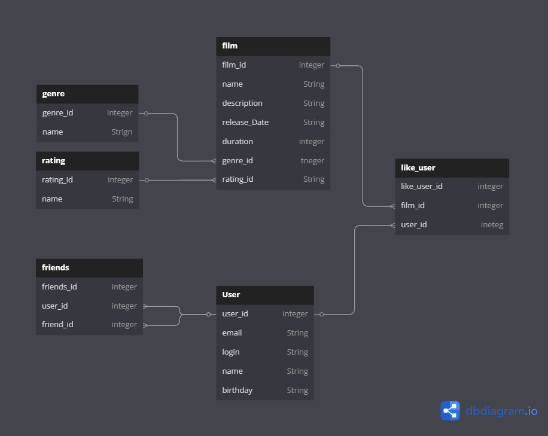

# java-filmorate
Template repository for Filmorate project.

# База данных

## Film

Содержит данные о фильма

Таблица влючает такие поля:

* film_id - первичный ключ;
* name - название фильма;
* description - описание фильма;
* release_date - дата релиза;
* duration - продолжительность фильма в минутах;
* внешний ключ genre_id(ссылается на таблица Genre) - жанр фильма
* внешний ключ rating_id(ссылается на таблицу Rating) - рейтинг фильма.

## Friends

Содержит данные о друзьях пользователей 

Таблица включает такие поля:

* friends_id - первичный ключ;
* внешний ключ user_id(ссылается на таблицу User) - пользователь;
* внешний ключ friends_id(ссылается на таблицу User) - друг пользователя.

## Genre

Содержит данные о жанрах фильмов

Таблица включает такие поля:

* genre_id - первичный ключ;
* name - название жанра.

## Like_user

Содержит данные о лайках пользователей

Таблица включает такие поля:

* like_user_id - первичный ключ;
* внешний ключ film_id(ссылается на таблицу Film) - лайкнутый фильм;
* внешний ключ user_id(ссылается на таблицу User) - пользователь, который лайкнул фильм.

## Rating

Содержит данные о рейтинге фильмов

Таблица включает такие поля:

* rating_id - первичный ключ;
* name - название рейтинга.

## User

Содержит данные о пользователях

Таблица включает такие поля:

* user_id - первичный ключ;
* email - электронный почтовый адрес пользователя;
* login - логин пользователя;
* name - ФИО пользователя;
* birthday - день рождение пользователя.

# Примеры запросов

SELECT *\
FROM user;

SELECT name\
FROM film\
WHERE duration > 30;